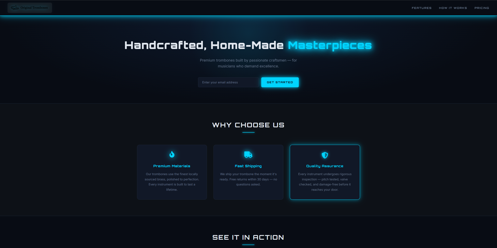
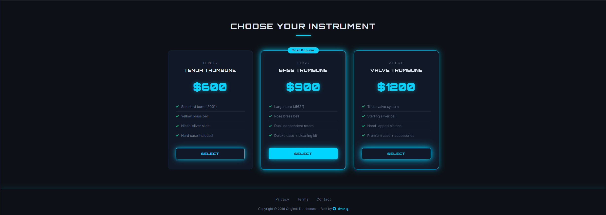
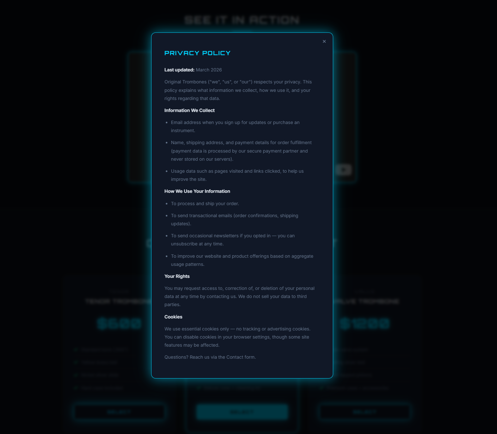
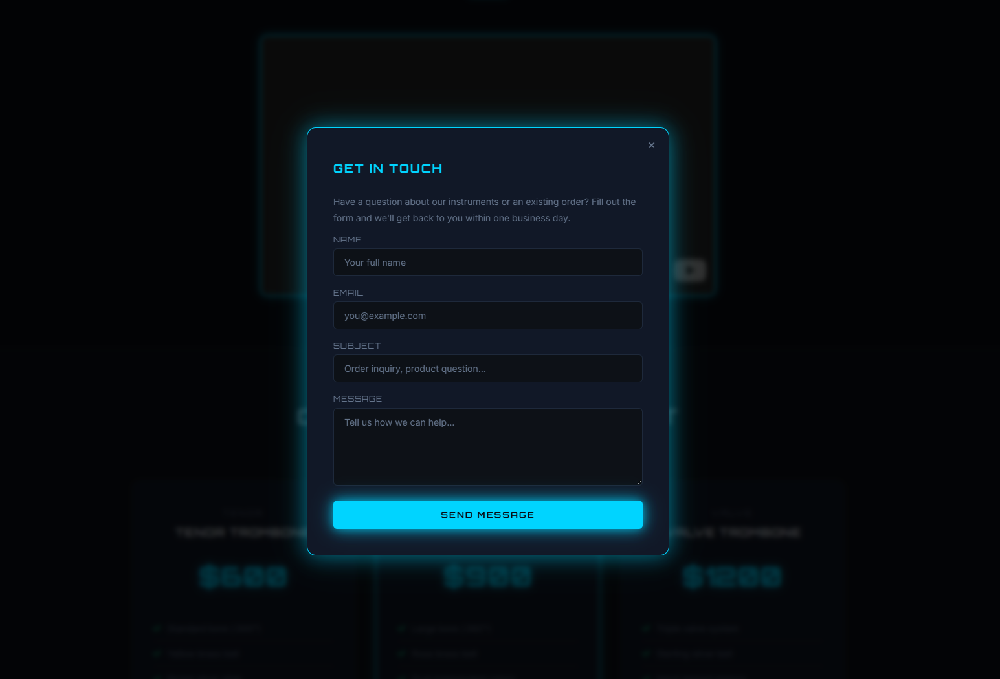

# Product Landing Page - Original Trombones

A fully featured product landing page for a fictional instrument brand. Dark cyan-glow theme, six CSS animations, a three-tier pricing section, an embedded demo video, and three working modal dialogs - built with HTML, CSS, and a small amount of vanilla JavaScript.

---

## What it does

Presents a product with a hero sign-up form, three feature cards, a product demo video, and a pricing comparison. Footer links open modal dialogs for Privacy Policy, Terms of Service, and a Contact form with a live success state. Everything is self-contained - no backend, no framework, no build step.

---

## Demo






> **To run locally:** open `index.html` directly in any browser. No server needed.

---

## Stack

| Layer | Tech |
|---|---|
| Structure | HTML5 - semantic `header`, `main`, `section`, `nav`, `footer`, ARIA modal attributes |
| Styling | CSS3 - custom properties, CSS Grid, `clamp()`, `backdrop-filter`, six keyframe animations |
| Logic | Vanilla JavaScript - modal open/close, backdrop click, Escape key, form success state |
| Fonts | Orbitron (headings/labels) + Inter (body) via Google Fonts |
| Icons | Font Awesome 5 |

No npm. No framework. No build step.

---

## Getting started

```bash
# Clone the repo
git clone https://github.com/dmtr-g/product-landing-page.git
cd product-landing-page

# Open in browser (pick your OS)
open index.html        # macOS
start index.html       # Windows
xdg-open index.html    # Linux
```

Or just double-click `index.html` in your file explorer.

---

## Features

- **Fixed frosted-glass header** - `position: fixed` with `backdrop-filter: blur(12px)`, stays visible while scrolling, animates with a continuous `glowPulse` border
- **Animated nav underline** - `::after` pseudo-element on each link grows from 0 to 100% width on hover via CSS transition, no JavaScript
- **Hero email form** - inline flexbox form with a glowing focus state on the input and a pulsing `GET STARTED` button
- **Feature cards grid** - CSS Grid `repeat(auto-fit, minmax(260px, 1fr))` with staggered floating icon animations using `:nth-child` delays
- **Embedded video** - YouTube Privacy-Enhanced Mode (`youtube-nocookie.com`) inside a `borderGlow` animated wrapper
- **Three-tier pricing** - CSS Grid layout with a featured "Most Popular" card that has a permanent glow, a floating badge, and a filled CTA button; standard cards use outline buttons with staggered pulse animations
- **Three working modals** - Privacy Policy, Terms of Service, and Contact form, each triggered by footer links using `data-modal` attributes
- **Modal accessibility** - `role="dialog"`, `aria-modal="true"`, `aria-labelledby` on every modal, Escape key closes any open modal, clicking the backdrop closes it
- **Contact form success state** - submit button changes to "SENT!" with a green background, then the modal auto-closes after 1.2 seconds
- **Six CSS keyframe animations** - `pulse`, `glowPulse`, `iconFloat`, `fadeInUp`, `borderGlow`, `textPulse` - each used on different elements independently
- **Staggered animation delays** - feature card icons and pricing buttons use `:nth-child` to offset their loops so they don't flash in sync
- **Fluid typography** - `clamp()` on the hero title and section headings scales text between viewport sizes without extra breakpoints
- **Responsive** - single breakpoint at 720px collapses both grids to one column, stacks the header, and resizes the video

---

## Project structure

```
Product-Landing-Page/
├── index.html    # Markup, modal content, and embedded JavaScript
├── styles.css    # 13-section stylesheet with design tokens, animations, and responsive
└── README.md
```

---

## What I learned / Why I built this

This was the freeCodeCamp Responsive Web Design product landing page project, extended significantly with modals, animations, and JavaScript interactivity.

Key things practised:

- `data-*` attributes as a clean way to wire JavaScript behaviour to HTML elements without hardcoding IDs in event listeners
- `document.body.style.overflow = 'hidden'` to lock background scroll when a modal is open - a common pattern that's easy to forget
- `e.target === overlay` to distinguish a click on the backdrop from a click inside the modal box, enabling close-on-backdrop without extra markup
- CSS design tokens (`--accent`, `--accent-glow`, `--accent-soft`) with multiple opacity variants - lets you build a full glow system from a single base colour
- `box-shadow` layering - combining outer glow and `inset` glow in one declaration for depth without extra elements
- `clamp()` for fluid type scaling — `clamp(28px, 5vw, 52px)` gives a responsive font size that needs no media queries
- `grid-template-columns: repeat(auto-fit, minmax())` for self-organising responsive grids - both the feature and pricing grids use this, collapsing naturally without a breakpoint
- `youtube-nocookie.com` embed domain for privacy-respecting video embeds that don't set cookies until the user presses play

---

## Author

**Dumitru Gafincu** - [github.com/dmtr-g](https://github.com/dmtr-g) - 115009621+dmtr-g@users.noreply.github.com

---

*Built as part of the freeCodeCamp Responsive Web Design curriculum.*
